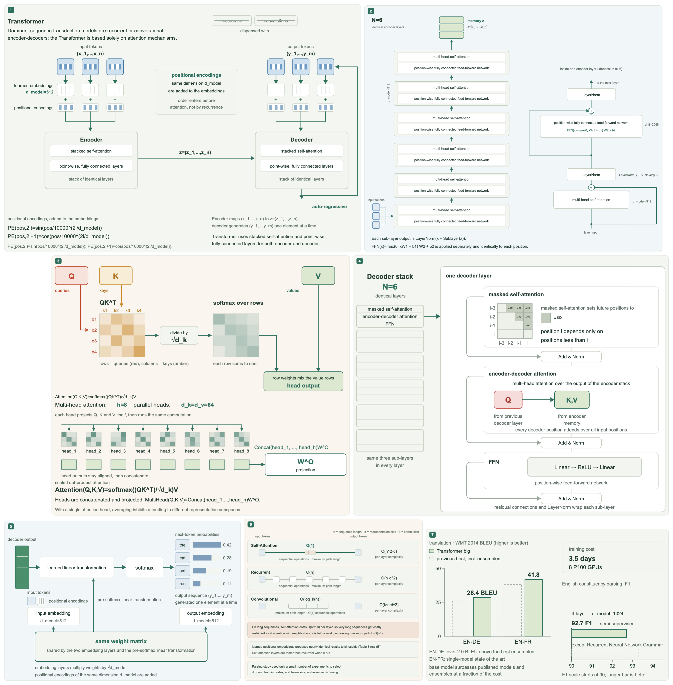

  

# LocalXiv

Read arXiv papers comfortably. On your Mac or Kindle.

LocalXiv turns arXiv and alphaXiv links into a paper library on your Mac. Adjust the reading layout, explore optional visual explanations, and export an EPUB for your Kindle. Keep the original paper beside the explanation so you can check what it actually says.

**[Download v0.0.12 for Mac](https://github.com/Akhil-Theerthala/LocalXiv/releases/tag/v0.0.12)** · Apple Silicon · macOS 26 or newer

Free and open source. No AI account is needed to import, read, or export papers. Optional AI features use your own provider and API key.

## From a paper link to a reading session

- Paste an arXiv or alphaXiv link and save the paper to your local library.
- Read with adjustable fonts, text size, margins, and appearance, including rendered equations.
- Use an **Overview** to explore a paper visually, a **Blog** for a longer explanation, or chat to ask a question.
- Export the paper or an available explanation as an EPUB, or send it to Kindle through Apple Mail.

The app includes *Attention Is All You Need* with a saved Overview and Blog. You can explore that example before connecting an AI provider.

See a figure from the included example

  

This is a generated illustration, not a figure authored by the paper's researchers. It was generated on 2026-09-18 by the scene-layout Overview workflow with deepseek-flash in four requests. The bundled sample's saved Overview is older; see its [source and generation provenance](app/sample/attention/README.md).

LocalXiv is an early preview. Conversion can be imperfect, and AI explanations can contain mistakes even after automated review.

## Start reading

1. Download a DMG from the releases page and drag **LocalXiv** into **Applications**.
2. Open LocalXiv and paste an arXiv or alphaXiv link.
3. Open the saved paper. Adjust the font, text size, margins, and appearance to suit your reading.

The packaged app includes its conversion tools. You do not need Homebrew, Python, or an AI account to import and read papers.

The current public preview is ad hoc signed and is not notarized by Apple. macOS may block the first launch. See the [installation and update instructions](docs/macos-release.md) and the notes attached to your downloaded release.

Conversion is imperfect, especially for unusual equations, tables, and layouts. LocalXiv retains the original paper and can fall back to it when EPUB conversion fails.

## Understand a paper

The reader separates the retained paper from generated explanations:

| View | What it provides |
| --- | --- |
| **Paper** | The retained paper, with adjustable reading settings. |
| **Overview** | A visual explanation of the contribution, mechanism, and evidence. |
| **Blog** | A longer explanation with source citations and optional focused drawings. |

You can also ask questions about the paper. Generated explanations and answers are aids to reading; check important claims against the source. Generation may take several minutes or fail, and support varies by provider and model.

To enable AI, open **Settings → AI connection**, choose a provider, enter a model and API key, then test and save the connection. Presets are available for OpenAI, OpenRouter, DeepSeek, and Gemini. **Custom** accepts other compatible API endpoints; compatibility is not guaranteed for every model.

Overview generation after import is opt-in. Blog generation is manual and works without an existing Overview. Blog figures are drawn separately; an unsuccessful drawing may be omitted after bounded repair attempts. Language and length settings control the explanation.

An Overview is one dense column of up to four panels. The model extracts a digest of the paper and a scene tree of cards, groups, grids, steps, and bars; the application lays the scene out and routes the arrows. See the [Overview scene layout design](docs/superpowers/specs/2026-09-18-overview-scene-layout-design.md).

## Read on Kindle

Open **Share** to export an EPUB, or expand **Send to Kindle** to send through Apple Mail. You can choose the paper or an available generated explanation.

For Mail delivery, add your Kindle email in **Settings → Kindle delivery**, configure Apple Mail, and approve your sending address in your Amazon account. Confirm delivery on the Kindle itself.

## Your library and AI connection

- Papers and settings are stored under `~/Library/Application Support/LocalXiv/library`.
- Removing the app leaves the library in place. Removing a paper inside LocalXiv deletes its retained files and associated explanations and chat history; previously exported copies remain.
- API keys are stored in macOS Keychain. AI requests use your configured provider and may incur that provider's charges.
- AI generation and questions send selected paper content to the provider. Image-enabled workflows can also send paper figures and generated drawings. Related-paper recommendations use the provider too.
- Importing papers requires network access. Reading saved papers and exporting their EPUBs do not require AI credentials.

## Built with GPT-6 Astra in Codex

LocalXiv was developed primarily with GPT-6 Astra in Codex. That work spans the Mac reader, paper conversion and export, AI explanation workflows, tests, and release tooling. This repository contains the implementation and [recorded verification work](docs/verification/2026-09-16-svg-reliability.md).

For visitors from the [Product Hunt GPT-6 Astra Challenge](https://www.producthunt.com/contests/gpt-6-astra-challenge), Astra's role is in building LocalXiv. The model used inside the app is selected separately in **Settings → AI connection**. You can use the reading and export workflow without connecting any model.

## Development

The desktop app uses a Swift/AppKit launcher, a WebKit reader, and a local Python service. SQLite stores the library and job records. Conversion and AI generation run as separate jobs, so a failed explanation does not invalidate a retained paper.

| Area | Start here |
| --- | --- |
| App requests and jobs | [app/server.py](app/server.py) |
| Library and saved generations | [papers/library.py](papers/library.py) |
| Import and conversion recovery | [papers/convert.py](papers/convert.py) |
| Retained source selection | [papers/reading.py](papers/reading.py) |
| Overview generation | [papers/overview_workflow.py](papers/overview_workflow.py) |
| Blog generation | [papers/agent_overviews.py](papers/agent_overviews.py) |
| Figure authoring and validation | [papers/panel_authoring.py](papers/panel_authoring.py), [papers/html_figures.py](papers/html_figures.py) |

See [development setup and checks](docs/development.md), [macOS release tooling](docs/macos-release.md), and the [Blog workflow status and pilot limitations](docs/blog_refactor.md). The included sample has its own [source and generation provenance](app/sample/attention/README.md); it is not evidence that every new generation will succeed.

To report a problem, [open an issue](https://github.com/Akhil-Theerthala/LocalXiv/issues) with your app version, macOS version, paper link, and the step that failed. For AI failures, include the provider and model, but never an API key.

## License

LocalXiv's original code is licensed under [AGPL-3.0-or-later](LICENSE). Third-party components retain their own licenses, listed in [NOTICE](NOTICE) and [dependency licenses](docs/dependency-licenses.md).
